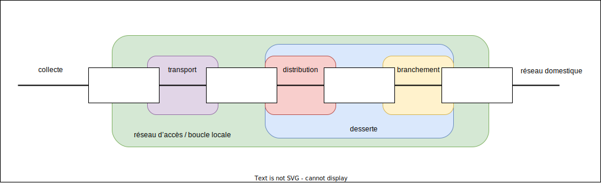
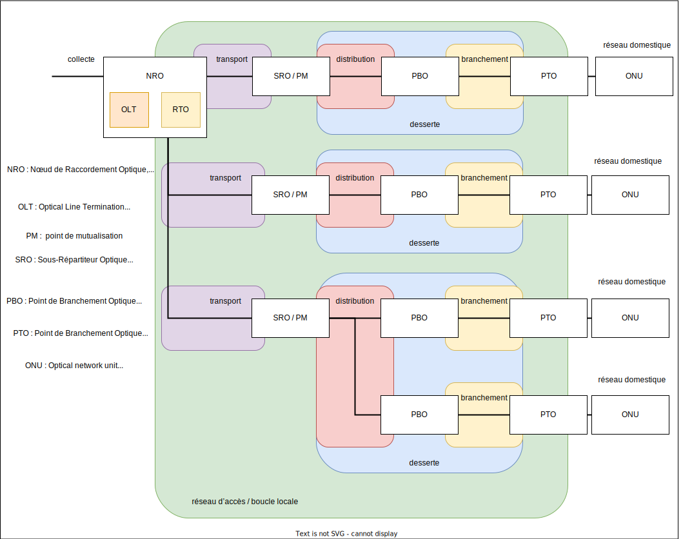
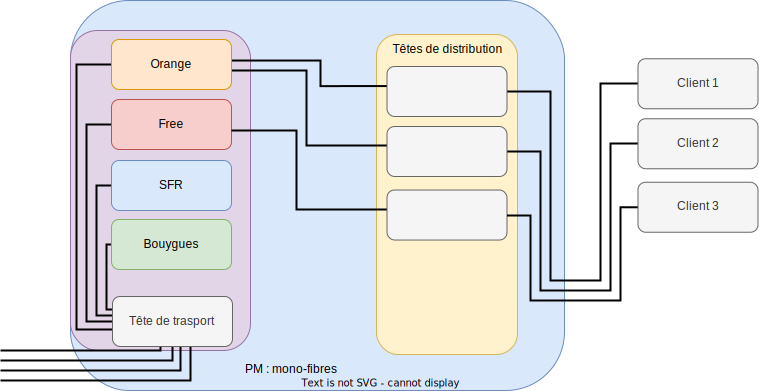
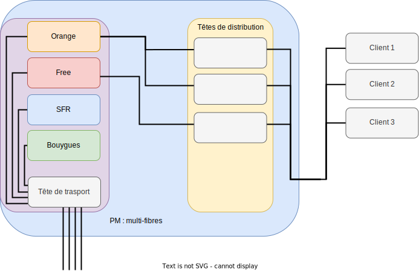
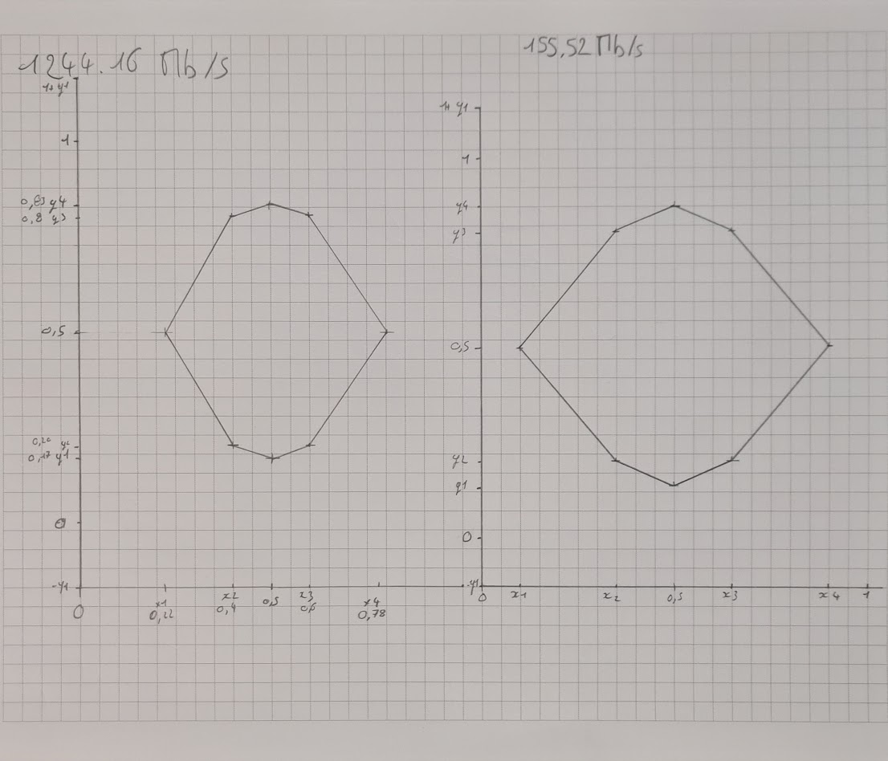

# Première partie : Etude du réseau d’accès optique en France

<link rel="stylesheet" type="text/css" href="style.css">

Le but est d’acquérir une bonne connaissance du réseau d’accès fibre

## I.Aspects structurels

> 1/Question très générale pour commencer : faire les recherches adéquates afin de pouvoir faire un schéma faisant apparaître les différents segments du réseau de manière générale :collecte, transport, distribution, branchement, desserte, réseau domestique. Et indiquer sur votre schéma ce qu’on appelle réseau d’accès. Trouver l’autre nom du réseau d’accès.

Source (P8) : `https://www.acome.com/sites/default/files/marches/ssmarch/-2019-07-15/Guide%20CREDO%202018_Technologies%20et%20composants%20du%20rC%CC%A7seau%20d%27accC%CC%A7s.pdf`

> 2/Rechercher les différents acronymes FTTxx et ce qu’ils signifient (jusqu’à où arrive la fibre). Il n’est pas nécessaire d’être exhaustif.

Acronymes   | Signification                     | Explication
---------   |----------                         |---------
 FTTH       | Fiber to the Home                 | Raccordement de l'abonné jusqu'au réseaux opérateurs
 FTTLA      | Fiber To The Last Amplifier       | Sur les réseaux finissant par du cable coaxial, c'est la dernière portion en fibre
 FTTB       | Fiber To The Building             | De meme que pour le précédent mais cette foie ci uniquement sur les réseaux fibre
 FTTN       | Fiber To The Node                 | Permet d'augmenter le debit en réduisant la taille du suivre en augmentant la proportion de fibre jusqu'au sous repartiteur
 FTTDP      | Fiber To The Distribution Point   | C'est un réseau fibre qui se termine par du cuivre
 FTTO       | Fiber To The Office               | Permet au entreprise d'avoir une fibre dédiée

Source : `https://fibre.guide/deploiement/technologies`

> 3/Dans le cas de la fibre optique, expliquer ce qu’est une architecture point à point, et une architecture point multipoint.

Dans une architecture point à point chaque terminaison a une extrémité qui est reliée directement sans dispositif intermédiaire.

Dans une architecture point multipoints les noeuds du réseau sont connecter à plusieurs terminaux.

Source : `http://igm.univ-mlv.fr/~dr/XPOSE2007/ffraux_FTTH/solutions.html`

>4/Les boucles locales optiques sont mutualisées (BLOM) ou dédiées (BLOD). Expliquer. Dans la suite, on ne s’intéressera pas aux BLOD.

Les boucles locales optiques mutualisées (BLOM) sont des réseaux a plusieurs utilisateur qui sont tous connectés à un seul noeud.

Les boucles locales optiques dédiées (BLOD) sont des réseaux fibre point à point directement reliés au backbone.

Source : `https://essonnenumerique.com/glossaire/blom-boucle-locale-optique-mutualisee/` & `https://wholesalefrance.orange.fr/fr/nos-reseaux/fibre-optique/`

> 5/On considère un réseau GPON. Que veut dire le sigle GPON ? Qu’est-ce qu’un réseau GPON ? Préciser quelle est la norme des réseaux GPON.

Un GPON c'est un réseau optique passive gigabit (Gigabit Passive Optical Network), c'est un réseau optique point multipoint. Il est passif, il utilise une fibre pour plusieurs utilisateur. Il est défini par la norme internationale ITU-T G.984.

Source : `https://www.tp-link.com/fr/blog/289/qu-est-ce-que-gpon-et-pourquoi-le-choisir-/` & `https://fr.wikipedia.org/wiki/GPON#:~:text=Le%20standard%20GPON%20succ%C3%A8de%20en,dans%20chaque%20sens%20de%20transmission.`

> 6/ Faire un schéma représentatif d’un réseau GPON avec :un NRO, plusieurs SRO, plusieurs PBO, plusieurs PTO, des clients. Le but est de visualiser l’architecture globale : un NRO peut-il être relié à un seul SRO ou plusieurs, etc. Les différents segments de réseau vus en question 1 doivent apparaître. Pour chaque élément (NRO, SRO, PBO, PTO) donner une description rapide et significative pour vous.Trouver où se trouvent les PM (Points de mutualisation) sur le schéma et expliquer ce que cela signifie (pourquoi on les appelle ainsi). Chercher ensuite ce qu’est un OLT et préciser sur le schéma où il sera. Chercher aussi ce qu’est un ONU et préciser sur le schéma où il sera.

Source : `https://lafibre.info/images/pon/202001_schema_blom_boucle_local_optique_mutualisee.pdf`

> 7/Toujours dans le cas d’un réseau GPON, on considère une fibre qui arrive sur un SRO depuis le NRO. Quel est l’équipement qui va permettre à partir de cette fibre de desservir plusieurs PBO ?

C'est un splitter a fibre optique, il permet de diviser le faisceau lumineux en plusieurs fibres.

Source : `https://community.fs.com/fr/blog/what-is-a-fiber-optic-splitter-2.html`

> 8/On distingue les zones de déploiement très denses (ZTD) des zones de déploiement moins denses (ZMD). De plus, dans les ZTD sont définies des zones de basse densité, ZTD-BD. Trouver comment, en France, se répartit le nombre total de lignes entre les trois types de zones.

Les ZTD (ZONES TRÈS DENSES), parties du territoire définies par l’ARCEP, les opérateurs doivent developper leurs propres réseaux (seuls ou en collaboration), il doit amener la fibre depuis son NRo jusqu'au PM.

Les ZMD (ZONES MOINS DENSES), parties du territoire définies par l’ARCEP, parties du territoire où la population est moins dense, elle impose donc une mutualisation des réseaux.

Source : `https://fibre.guide/deploiement/zmd` & `https://fibre.guide/deploiement/ztd`

> 9/Ordres de grandeur :Un NRO peut desservir combien d’abonnés ? Le segment de fibre NRO-SRO peut faire jusqu’à quelle longueur en ZTD ? Et en ZMD ? Un PM peut desservir combien de lignes ?

...

> 10/Expliciter ce que veulent dire le sens montant et le sens descendant (utiliser votre schéma pour être précis).

Source : `https://reseaux.orange.fr/questions/adsl-vdsl2/debit-montant-descendant`

> 11/En réseau FTTH, la desserte peut être mono-fibre (1 seule fibre est affectée par client) ou multi-fibres (pour chaque client, 1 fibre est dédiée à chaque opérateur).Faire un schéma au niveau du PM avec des fibres arrivant d’un coté, provenant de plusieurs opérateurs, et des fibres repartant de l’autre coté, vers plusieurs clients, lorsque la desserte est mono-fibre puis recommencer lorsque la desserte est multi-fibres.La desserte multi-fibres est intéressante lorsqu’un abonné change d’opérateur. Expliquer.

Elle est intéressante car elle demande une intervention moindre d'un technicien lors du changement de fournisseur.

Source : `https://lafibre.info/images/pon/202001_schema_blom_boucle_local_optique_mutualisee.pdf`

> 12/En réseau FTTH, il existe différentes situations réglementaires :En ZTD, cas des immeubles de plus de 12 logements En ZTD, cas général des immeubles de moins de 12 logements. En ZTD, cas particulier des immeubles isolés de moins de 12 logements. En ZTD, poches de basse densité. En ZMD. Pour chacune de ces 5 situations, trouver où sera situé le PM, ainsi que le PBO, combien de lignes le PM peut desservir, et si la desserte est  mono-fibre ou multi-fibres.Pour les situations où la desserte est  multi-fibres, trouver pourquoi.

Cas des immeubles de plus de 12 logements en ZTD :

- PM en pied d'immeuble, jusqu'a 4 fibres par logement.
- PBO jusqu'à 12 logements, distants de moins d'une centaine de mètres
- Multi-fibres (pour regrouper plus d'abonnés)

Cas général des immeubles de moins de 12 logements en ZTD :

- PM en armoire avec moins de 100 lignes en mono-fibre
- PBO jusqu'à 12 logements, distants de moins d'une centaine de mètres
- Multi-fibres (pour regrouper plus d'abonnés)

Cas particulier des immeubles isolés de moins de 12 logements en ZTD :

- PM installé en chambre, en borne ou en façade
- PBO jusqu'à 12 logements, distants de moins d'une centaine de mètres
- Multi-fibres (pour regrouper plus d'abonnés)

En ZTD, poches de basse densité :

- PM installé avec moins de 300 lignes en mono-fibre.
- PBO pour un seul local
- Mono-fibre (pas besoin de multi fibres)

En ZMD :

- PM installé avec moins de 1000 lignes en mono-fibre.
- PBO qui desservent trois voir deux locaux
- Mono-fibre (pas besoin de multi fibres)
  
Source (P22 & 23) : `https://www.acome.com/sites/default/files/marches/ssmarch/-2019-07-15/Guide%20CREDO%202017_DC%CC%A7ploiement%20des%20rC%CC%A7seaux%20FTTH%20en%20ZMD.pdf`

> 13/Dans quel type de situation la fibre multimode est-elle utilisée ? Trouver également les différentes qualités de fibres multimodes qui existent.

Les fibres multimodes sont utiliser sur de courte distance, elle sont moins chère que les monomodes et permettent d'avoir un plus grand debit. Exemple de fibres :

- Fibre multimodes standard 50/125 : utilisées pour applications de courte distances; vitesses ~ 1 Gb/s.
- Fibre multimodes à large bande (OM3) : vitesses plus élevées pour réseaux de données à grande vitesse (SAN).
- Fibre multimodes à bande large à faible dispersion (OM4) : utilisées pour les applications à très haute vitesse et pour les réseaux de données de grande capacité.

Source : `https://community.fs.com/fr/blog/advantages-and-disadvantages-of-multimode-fiber.html`

## II. Spécifications télécoms du réseau GPON

### Dans cette partie, vous vous appuierez sur la norme ITU-T G.984.2 pour la plupart des questions. Préciser alors le numéro de la page. Toutes les questions de cette partie font référence au réseau GPON

> 1/Quels sont les débits nominaux possibles dans le sens descendant ? Dans le sens montant ?

Les taux de transmission nominaux en direction descendante sont de 1244,160 Mbit/s et 2488,320 Mbit/s, tandis que les taux de transmission nominaux en direction montante sont de 155,520 Mbit/s, 622,080 Mbit/s, 1244,160 Mbit/s et 2488,320 Mbit/s. (pdf page 3)

> 2/En vous appuyant sur la question précédente, donner un exemple de transmission symétrique et de transmission asymétrique.

Une connexion symétrique est une connexion qui a un débit nominal identique en montant et en descendant. Tandis qu'une connexion asymétrique est une connexion où le débit est différent entre le sens montant et le sens descendant.

> 3/Quelle est la situation la plus fréquemment rencontrée ?

La situation la plus fréquente est une connexion asymétrique.

> 4/Quelles sont les deux méthodes possibles pour transmettre dans les deux sens ?

La transmission dans les deux sens est faisable en utilisant soit la technique de multiplexage par division de longueur d'onde sur une seule fibre, soit une transmission unidirectionnelle sur deux fibres.

> 5/Quelle est la méthode de codage des bits ? Qu’est-ce que cela signifie en termes de signal ?

Le codage utilisé est du NRZ (Non-Return-to-Zero), avec un niveau élevé d'émission de lumière pour un "1" et un niveau faible d'émission de lumière pour un "0". (pdf page 12)

> 6/Quelle est la plage de longueurs d’onde réservée au sens descendant ? Donner aussi la valeur médiane. Calculer la bande de fréquences correspondante (en prenant un indice égal à 1).

La plage de longueur d'onde de fonctionnement en sens descendant sur les systèmes à une seule fibre est de 1480 nm à 1500 nm. La médiane est 1490 nm. La fréquence est de 2.01 × 10^14 Hz (f = 3 × 10^8 / (1490 × 10^-9)). (pdf page 12)

La plage de longueur d'onde de fonctionnement en sens descendant sur les systèmes à deux fibres est de 1260-1360nm. La médiane est 1310 nm. La fréquence est de 2.30 × 10^14 Hz (f = 3 × 10^8 / (1310 × 10^-9)). (pdf page 12)

> 7/Quelle est la plage de longueurs d’onde réservée au sens montant ? Donner aussi la valeur médiane. Donner la bande de fréquences correspondante (en prenant un indice égal à 1).

La plage de longueur d'onde de fonctionnement en sens descendant est de 1260-1360nm.La médiane est 1310 nm. La médiane est 1310 nm. La fréquence est de 2.30 × 10^14 Hz (f = 3 × 10^8 / (1310 × 10^-9)). (pdf page 12)

> 8/Citer la norme qui définit les fibres qui peuvent être utilisées dans un réseau GPON  (d’après la norme ITU-T G.984.2).

La G.984.3 est la norme qui définit les exigences pour les fibres optiques utilisées pour les réseaux GPON. (pdf page 3)

> 9/Ces fibres peuvent être du type SM, MM ou les deux ?

Les fibres utiliser sont des fibre SM et MM. (bas de page n°1)

> 10/Dans la norme  ITU-T G.984.2 on lit qu’en sortie de l’OLT, dans le sens descendant, l’ORL doit être d’au moins 32 dB. Expliquer ce que cela veut dire. Soyez précis. Traduire le nombre en pourcentage de puissances.

ORL veut dire "Optical Return Loss", et OLT "Optical Line Termination".

La perte optique totale (ORL) entre la sortie de l'OLT et la fin de l'abonné doit être au moins de 32 dB. Un perte de 32dB revient a conserver 0.0631% de la puissance initiale.

> 11/Quelle est la distance couverte maximale dans un réseau GPON ?

La distance maximale est de 20 km selon le tableau page 10 (bas de page).

> 12/Il existe 3 classes d’atténuation, les classes A, B et C. Selon la classe, la plage d’atténuation n’est pas la même. Noter les valeurs et expliquer ce qu’elles veulent dire.

Classe      | plage d'atenuation
---------   |----------
 A          | 5-20
 B          | 10-25
 C          | 15-30

Ces plage représentent l'atténuation en bout de ligne. Source page 10 (bas de page).

> 13/ Dans la norme  ITU-T G.984.2 on lit par exemple les spécifications suivantes :en sortie de l’OLT, dans le sens descendant, et pour un débit de 1 244 Mbits/s,

/ | / | A | B | C
---------|----------|---------|---------|---------
 Mean launched power MIN | dBm | -4 | +1 | +5
 Mean launched power MAX | dBm | +1 | +6 | +9

> Interpréter ce que ces données veulent dire (il n’est pas nécessaire de convertir en W)

C'est la puissance de minimal et maximal envoyer par l'OLT. Ces donne nous permettent de choisir l'OLT adapté à nos besoin.

> 14/Toujours dans le sens descendant et pour un débit de 1 244 Mbits/s, lorsqu’on lit que la sensibilité minimum du récepteur (au niveau de l’ONU) est de -25 dBm, qu’est-ce que cela veut dire ? Ici la conversion dans l’unité adéquate est demandée

C'est la valeur de puissance minimale que peut recevoir un ONU soit 3,16 uW.

> 15/Définir le  ‵‵Bit error ratio′′ (ne pas confondre avec le Bit error rate). Comment doit-il être pour respecter la norme ? Donner une réponse claire si vous avez compris.

Le BER (Bit error ratio) c'est nombre de bits erronés divisé par le nombre total de bits transmis. Il doit être de moins de 10^-10 et moins de 10^-4 pour une fibre en sens montant de class C+. Page du doc 38 et 16.

> 16/Vous avez ici un cas pratique d’utilisation du diagramme de l’oeil.Dans la norme ITU-T  G.984.2, sont spécifiés des masques de conformité pour chaque débit et chaque sens de transmission. Ce sont les figures 2 et 3.En vous servant des données figure 3, reproduire sur le même système d’axes et avec une échelle bien choisie les masques de deux diagramme de l’oeil pour deux débits différents (155,52 Mbits/s et 1244,16 Mbits/s) afin de pouvoir les  comparer. Vous  pouvez tracer les  courbes  sur papier et en prendre une photo.En vous servant de vos connaissances en  R305, interpréter alors votre figure.

"On peut voir sur le diagramme de l'œil pour un débit de 155,52 Mb/s que l'œil est plus grand, ce débit est donc moins sensible au bruit.

> 17/Budget optique. La situation la plus fréquente concernant le choix des débits est traitée en annexe A (p 32).La table A.1 fournit les seuils min et max de puissance injectée au niveau de l’OLT et de l’ONU. Elle fournit également les seuils de sensibilité en réception ainsi que la puissance maximale admise par le récepteur.De ce tableau résulte la table A.2 : pour les deux longueurs d’onde utilisées, la perte de puissance le long de la ligne entre l’OLT et l’ONU doit être supérieure à 13 dB et inférieure à 28 dB. Justifier, à partir de la table A.1, pourquoi la perte de puissance ne doit pas dépasser 28 dB pour les deux situations correspondant aux deux longueurs d’onde. Justifier, à partir de la table A.1, pourquoi la perte de puissance doit être d’au moins 13 dB pour les deux situations correspondant aux deux longueurs d’onde. En pratique, un OTDR peut servir à tester une liaison de ce type et vérifier que son budget optique reste dans les limites permises.

Les limites de perte dans la table 2 (A.2) sont définies en fonction des sensibilités en reception et des puissances maximales du récepteur de la table 1 (A.1). La sensibilité minimale c'est la quantité minimale de puissance optique qui doit être reçue pour garantir la bonne réception des données. La puissance maximale admise c'est la quantité maximale de puissance optique que le récepteur peut gérer sans être endommagé.

Si les pertes sont inférieures à 13 dB, le signal peut endommager le récepteur par surcharge. Si la perte est supérieure à 28 dB la puissance de reception peut être inférieure à la sensibilité maximale du récepteur ce qui peut entraîner une mauvaise reception des données.

Donc les perte ne doivent pas excéder 28 dB pour garantir une bonne réception des donné tout en évitant d'endommager le récepteur.

> 18/Coupleurs optiques. Quelle est la fonction d’un coupleur optique ? On considère un coupleur 1 x 2 symétrique. Quelle est la perte de puissance en dB due à la division du signal ? En considérant la situation précédente pour laquelle la perte maximale est de 28 dB, et en négligeant toutes les autres sources de pertes, combien de coupleurs 1 x 2 pourraient être utilisés successivement (en cascade) ? En imaginant mettre autant de coupleurs que nécessaire, combien d’utilisateurs pourront alors être reliés à partir d’une seule fibre issue de l’OLT ? Dans ce cas, combien de coupleurs 1 x 2 faut-il ? Donner un autre exemple de coupleurs qui permettrait de relier le même nombre d’utilisateurs à partir d’une seule fibre. Vous pouvez accompagner vos réponses de schémas.

- Un coupleur optique est un composant qui permet de diviser ou de combiner des signaux optiques.
- Yn coupleur 1x2 symétrique, sont égale a une division du signal par deux donc une perte 3 dB en moyenne.
- La perte maximal est de 28 dB, ce qui signifie un maximum de 9 coupleurs 1x2 successivement en cascade.
- On peut relier jusqu'à 2^9=512 utilisateurs à partir d'une seule fibre issue de l'OLT.
- Ce qui donne 256 coupleurs (2^8).
- On peut utiliser quatre coupleurs 1 vers 128. (source `https://lafibre.info/images/materiel/201306_prysmian_module_optique_baie_mec128.pdf`)

> 19/Existe-t-il des coupleurs non symétriques (par exemple 20 % / 80 %) ? Si oui, chercher dans quelle situation cela peut servir et expliquer.

Oui il en existe. il sont utilisés par...

> 20/Quelle est la technique utilisée pour pouvoir combiner les transmissions de plusieurs utilisateurs sur une même fibre ? Expliquer son principe.Quel impact cela a t-il sur le débit ? Donner un exemple précis.

Un multiplexeur peut être utilisé pour connecter plusieurs utilisateurs sur la même fibre. Un multiplexeur temporelle repartie équitablement le temps d'utilisation de la fibre communes entre les différents utilisateurs, ce qui implique donc une réduction du débit proportionnel au nombres d'utilisateurs sur la fibre.

> 21/L’ONU d’un utilisateur reçoit-il les données destinées aux autres utilisateurs ? Si oui dans ce cas qu’est-ce qu’il utilise pour sélectionner seulement les informations qui lui sont destinées ?

Un utilisateur reçoit les données destinées à tous les utilisateurs du réseau. L'ONU vas utilisé son identifiant universel pour sélectionner les informations qui lui sont destinées.

> 22/Quelle est la technique qui permet de combiner le flux montant et le flux descendant sur la même fibre ?

Pour réaliser cela on utiliser le multiplexage en longueur d'onde (Wavelength Division Multiplexing). Cela consiste a utiliser différentes longueurs d'ondes pour transmettre des données dans des directions opposées sur la même fibre.

## III. Perspectives d’évolution

> On attend ici une petite étude des futurs réseaux GPON :première génération NG-PON1 (XG-PON), deuxième génération NG-PON2 (TWDM-PON), troisième génération NG-PON3 (WDM-PON).
> Notamment : le nom de la norme qui en définit toutes les spécifications (lorsque c’est possible), les débits, les longueurs d’ondes, les techniques de multiplexage, sachant que le but de l’évolution est de faire toujours plus et mieux pour l’utilisateur.

Les principales generations de GPON sont les suivantes :

- NG-PON1 (XG-PON) -> Cette generation est définie par la norme ITU-T G.983.3. Elle permet d'avoir un maximum de 10Gb/s en descendant et 2,5Gb/s en montant. Elle utilise un longueur d'onde de 1550 nm. Ce qui implique donc l'utilisation du multiplexage de longueur d'onde.
- NG-PON2 (TWDM-PON) -> Cette génération est définie par la norme ITU-T G.989. Elle permet d'avoir un maximum de 40Gb/s en descendant et 10Gb/s en montant. Elle utilise le TWDM (Time and Wavelength Division Multiplexing) comme technique de multiplexage. Elle utilise quatre longueurs d'ondes différente :
  - 1490 nm (descendante)
  - 1577 nm (montante)
  - 1625 nm (montante)
  - 1650 nm (descendante)
- NG-PON3 (WDM-PON) -> Cette génération est définie par une future norme pas encore définie. Le WDM correspond au Wavelength Division Multiplexing. Nous possédons peu d'informations sur cette nouvelle génération, cette génération prévoit un debit d'environ 100Gb/s.

Source (p29) : `https://www.theses.fr/2016ENST0076.pdf`