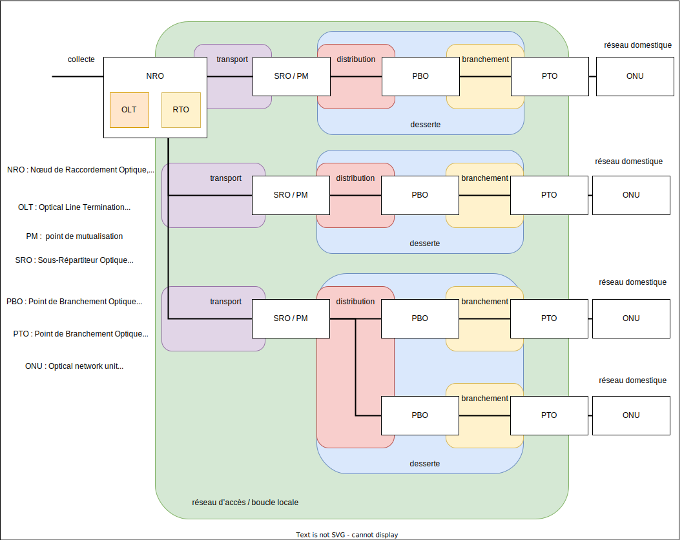
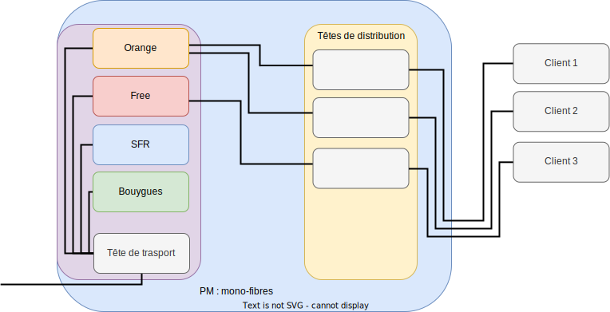
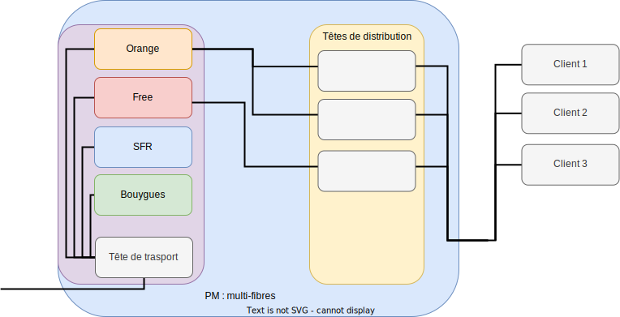

# Première partie : Etude du réseau d’accès optique en France

<link rel="stylesheet" type="text/css" href="style.css">

Le but est d’acquérir une bonne connaissance du réseau d’accès fibre

## I.Aspects structurels

> 1/Question très générale pour commencer : faire les recherches adéquates afin de pouvoir faire un schéma faisant apparaître les différents segments du réseau de manière générale :collecte, transport, distribution, branchement, desserte, réseau domestique. Et indiquer sur votreschéma ce qu’on appelle réseau d’accès. Trouver l’autre nom du réseau d’accès.

Source (P8) : `https://www.acome.com/sites/default/files/marches/ssmarch/-2019-07-15/Guide%20CREDO%202018_Technologies%20et%20composants%20du%20rC%CC%A7seau%20d%27accC%CC%A7s.pdf`

> 2/Rechercher les différents acronymes FTTxx et ce qu’ils signifient (jusqu’où arrive la fibre).Il n’est pas nécessaire d’être exhaustif.

Acronymes   | Signification                     | Explication
---------   |----------                         |---------
 FTTH       | Fiber to the Home                 | Racordement de l'abonner jusqu'au reseaux operateur
 FTTLA      | Fiber To The Last Amplifier       | Sur les reseaux finisant par du cable coaxial, c'est la derniere portion en fibre
 FTTB       | Fiber To The Building             | De meme que pour le precedant mais cette foie ci uniquement sur les reseaux fibre
 FTTN       | Fiber To The Node                 | Permet d'augmenter le debit en reduisant la taille du suivre en augmentant la proportion de fibre jusqu'au sous repartiteur
 FTTDP      | Fiber To The Distribution Point   | C'est un resaux fibre qui se termine par du cuivre
 FTTO       | Fiber To The Office               | Permet au entreprise davoir une fibre dedier

Source : `https://fibre.guide/deploiement/technologies`

> 3/Dans le cas de la fibre optique, expliquer ce qu’est une architecture point à point, et une architecture point multipoint.

Dans une architecture point a point chaque terminaison a une extremiter sont relier dorectement sans dispositif intermediere.

Dans une architecture point multipointn les noeuds du resaux sont connecter a plusieur terminaux.

Source : `http://igm.univ-mlv.fr/~dr/XPOSE2007/ffraux_FTTH/solutions.html`

>4/Les boucles locales optiques sont mutualisées (BLOM) ou dédiées (BLOD). Expliquer.Dans la suite, on ne s’intéressera pas aux BLOD.

Les boucles locales optiques mutualisées (BLOM) sont des reseaux a plusieur utilisateur qui sont tous connecter a un seul noeud.

Les boucles locales optiques dédiées (BLOD) sont des redeaux fibre point a point directement relier au backbone.

Source : `https://essonnenumerique.com/glossaire/blom-boucle-locale-optique-mutualisee/` & `https://wholesalefrance.orange.fr/fr/nos-reseaux/fibre-optique/`

> 5/On considère un réseau GPON.Que veut dire le sigle GPON ?Qu’est-ce qu’un réseau GPON ?Préciser quelle est la norme des réseaux GPON.

Un GPON c'est un reseaux opique passive gigabit (Gigabit Passive Optical Network), c'est un reseaux optique point multipoint. Il est passif, il utilise une fibre pour plusieur utilisateur. Il est définie par la norme internationale ITU-T G.984.

Source : `https://www.tp-link.com/fr/blog/289/qu-est-ce-que-gpon-et-pourquoi-le-choisir-/` & `https://fr.wikipedia.org/wiki/GPON#:~:text=Le%20standard%20GPON%20succ%C3%A8de%20en,dans%20chaque%20sens%20de%20transmission.`

> 6/ Faire un schéma représentatif d’un réseau GPON avec :un NRO, plusieurs SRO, plusieurs PBO, plusieurs PTO, des clients.Le but est de visualiser l’architecture globale : un NRO peut-il être relié à un seul SRO ou plusieurs,etc. Les différents segments de réseau vus question 1 doivent apparaître.Pour chaque élément (NRO, SRO, PBO, PTO) donner une description rapide et significative pour vous.Trouver où se trouvent les PM (Points de mutualisation) sur le schéma et expliquer ce que celasignifie (pourquoi on les appelle ainsi).Chercher ensuite ce qu’est un OLT et préciser sur le schéma où il sera.Chercher aussi ce qu’est un ONU et préciser sur le schéma où il sera.

Source : `https://lafibre.info/images/pon/202001_schema_blom_boucle_local_optique_mutualisee.pdf`

> 7/Toujours dans le cas d’un réseau GPON, on considère une fibre qui arrive sur un SRO depuis le NRO. Quel est l’équipement qui va permettre à partir de cette fibre de desservir plusieurs PBO ?

C'est un splitter a fibre optique, il permet de diviser le faisceau limineux en plusieur fibre.

Source : `https://community.fs.com/fr/blog/what-is-a-fiber-optic-splitter-2.html`

> 8/On distingue les zones de déploiement très denses (ZTD) des zones de déploiement moinsdenses (ZMD). De plus, dans les ZTD sont définies des zones de basse densité, ZTD-BD. Trouver comment, en France, se répartit le nombre total de lignes entre les trois types de zones.

Les ZTD (ZONE TRÈS DENSE), partie du territoire définie par l’ARCEP, les operateurs doivent developper son propre reseaux (seul ou en colaboration), il doit amner la fibre depuis son NRo jusqu'au PM.

Les ZMD (ZONE MOINS DENSE), partie du territoire définie par l’ARCEP, partie du teritoire ou la population est moins dense, elle impose donc une mutualisation des resaux.

Source : `https://fibre.guide/deploiement/zmd` & `https://fibre.guide/deploiement/ztd`

> 9/Ordres de grandeur :Un NRO peut desservir combien d’abonnés ?Le segment de fibre NRO-SRO peut faire jusqu’à quelle longueur en ZTD ? Et en ZMD ?Un PM peut desservir combien de lignes ?

...

> 10/Expliciter ce que veulent dire le sens montant et le sens descendant (utiliser votre schéma pour être précis).

Source : `https://reseaux.orange.fr/questions/adsl-vdsl2/debit-montant-descendant`

> 11/En réseau FTTH, la desserte peut être mono-fibre (1 seule fibre est affectée par client) ou multi-fibres (pour chaque client, 1 fibre est dédiée à chaque opérateur).Faire un schéma au niveau du PM avec des fibres arrivant d’un coté, provenant de plusieursopérateurs, et des fibres repartant de l’autre coté, vers plusieurs clients, lorsque la desserte est mono-fibre puis recommencer lorsque la desserte est multi-fibres.La desserte multi-fibres est intéressante lorsqu’un abonné change d’opérateur. Expliquer.

Elle est interesante car elle demande une intervention moindre d'un technicien lors du changement de fourniseur.

Source : `https://lafibre.info/images/pon/202001_schema_blom_boucle_local_optique_mutualisee.pdf`

> 12/En réseau FTTH, il existe différentes situations réglementaires :En ZTD, cas des immeubles de plus de 12 logements En ZTD, cas général des immeubles de moins de 12 logements. En ZTD, cas particulier des immeubles isolés de moins de 12 logements. En ZTD, poches de basse densité. En ZMD. Pour chacune de ces 5 situations, trouver où sera situé le PM, ainsi que le PBO, combien de lignesle PM peut desservir, et si la desserte est  mono-fibre ou multi-fibres.Pour les situations où la desserte est  multi-fibres, trouver pourquoi.

Cas des immeubles de plus de 12 logements en ZTD :

- PM en pied d'himeuble, jusqu'a 4 fibre par logement.
- PBO jusqu'à 12 logements, distants de moins d'une centaine de mètres
- Multi-fibres (pour regrouper plus d'aboner)

Cas général des immeubles de moins de 12 logements en ZTD :

- PM en armoire avec moins de 100 lignes en mono-fibre
- PBO jusqu'à 12 logements, distants de moins d'une centaine de mètres
- Multi-fibres (pour regrouper plus d'aboner)

Cas particulier des immeubles isolés de moins de 12 logements en ZTD :

- PM installé en combre, en borne ou en façade
- PBO jusqu'à 12 logements, distants de moins d'une centaine de mètres
- Multi-fibres (pour regrouper plus d'aboner)

En ZTD, poches de basse densité :

- PM installer avec moins de 300 lignes en mono-fibre.
- PBO pour un seul local
- Mono-fibre (pas besion de multi fibre)

En ZMD :

- PM installer avec moins de 1000 lignes en mono-fibre.
- PBO qui desservent trois voire deux locaux
- Mono-fibre (pas besion de multi fibre)
  
Source (P22 & 23) : `https://www.acome.com/sites/default/files/marches/ssmarch/-2019-07-15/Guide%20CREDO%202017_DC%CC%A7ploiement%20des%20rC%CC%A7seaux%20FTTH%20en%20ZMD.pdf`

> 13/Dans quel type de situation la fibre multimode est-elle utilisée ? Trouver également les différentes qualités de fibres multimodes qui existent.

Les fibres multimode sont utiliser sur de courte distance, elle sont moins chere que les monomodes et permete d'avoir un plus grand debit. Exemple de fobres :

- Fibre multimode standard 50/125 : utilisée pour applications de courte distance,vitesses ~ 1 Gb/s.
- Fibre multimode à large bande (OM3) : vitesses plus élevées pour réseaux de données à grande vitesse (SAN).
- Fibre multimode à bande large à faible dispersion (OM4) : utilisée pour les applications à très haute vitesse et pour les réseaux de données de grande capacité.

Source : `https://community.fs.com/fr/blog/advantages-and-disadvantages-of-multimode-fiber.html`

## II. Spécifications télécoms du réseau GPON

### Dans cette partie, vous vous appuyerez sur la norme ITU-T G.984.2 pour la plupart desquestions. Préciser alors le numéro de la page.Toutes les questions de cette partie font référence au réseau GPON

> 1/Quels sont les débits nominaux possibles dans le sens descendant ? Dans le sens montant ?

...

> 2/En vous appuyant sur la question précédente, donner un exemple de transmission symétriqueet de  transmission asymétrique.

...

> 3/Quelle est la situation la plus fréquemment rencontrée ?

...

> 4/Quelles sont les deux méthodes possibles pour transmettre dans les deux sens ?

...

> 5/Quelle est la méthode de codage des bits ? Qu’est-ce que cela signifie en termes de signal ?

...

> 6/Quelle est la plage de longueurs d’onde réservée au sens descendant ? Donner aussi la valeurmédiane. Calculer la bande de fréquences correspondante (en prenant un indice égal à 1).

...

> 7/Quelle est la plage de longueurs d’onde réservée au sens montant ? Donner aussi la valeurmédiane.Donner la bande de fréquences correspondante (en prenant un indice égal à 1).

...

> 8/Citer la norme qui définit les fibres qui peuvent être utilisées dans un réseau GPON  (d’aprèsla norme ITU-T G.984.2).

...

> 9/Ces fibres peuvent être du type SM, MM ou les deux ?

...

> 10/Dans la norme  ITU-T G.984.2 on lit qu’en sortie de l’OLT, dans le sens descendant, l’ORLdoit être d’au moins 32 dB. Expliquer ce que cela veut dire. Soyez précis. Traduire le nombre enpourcentage de puissances.

...

> 11/Quelle est la distance couverte maximale dans un réseau GPON ?

...

> 12/Il existe 3 classes d’atténuation, les classes A, B et C. Selon la classe, la plage d’atténuationn’est pas la même. Noter les valeurs et expliquer ce qu’elles veulent dire.

...

> 13/ Dans la norme  ITU-T G.984.2 on lit par exemple les spécifications suivantes :en sortie de l’OLT, dans le sens descendant, et pour un débit de 1 244 Mbits/s,

/ | / | A | B | C
---------|----------|---------|---------|---------
 Mean launched power MIN | dBm | -4 | +1 | +5
 Mean launched power MAX | dBm | +1 | +6 | +9
> Interpréter ce que ces données veulent dire (il n’est pas nécessaire de convertir en W)

...

> 14/Toujours dans le sens descendant et pour un débit de 1 244 Mbits/s, lorsqu’on lit que lasensibilité minimum du récepteur (au niveau de l’ONU) est de -25 dBm, qu’est-ce que cela veutdire ? Ici la conversion dans l’unité adéquate est demandée

...

> 15/Définir le  ‵‵Bit error ratio′′ (ne pas confondre avec le Bit error rate). Comment doit-il êtrepour respecter la norme ? Donner une réponse claire si vous avez compris.

...

> 16/Vous avez ici un cas pratique d’utilisation du diagramme de l’oeil.Dans la norme ITU-T  G.984.2, sont spécifiés des masques de conformité pour chaque débit etchaque sens de transmission. Ce sont les figures 2 et 3.En vous servant des données figure 3, reproduire sur le même système d’axes et avec une échellebien choisie les masques de deux diagramme de l’oeil pour deux débits différents (155,52 Mbits/s et1244,16 Mbits/s) afin de pouvoir les  comparer. Vous  pouvez tracer les  courbes  sur papier et enprendre une photo.En vous servant de vos connaissances en  R305, interpréter alors votre figure.

...

> 18/Coupleurs optiquesQuelle est la fonction d’un coupleur optique ?On considère un coupleur 1 x 2 symétrique.Quelle est la perte de puissance en dB due à la division du signal ?En considérant la situation précédente pour laquelle la perte maximale est de 28 dB, et ennégligeant toutes les autres sources de pertes, combien de coupleurs 1 x 2 pourraient être utiliséssuccessivement (en cascade) ?En imaginant mettre autant de coupleurs que nécessaire, combien d’utilisateurs pourront alors êtrereliés à partir d’une seule fibre issue de l’OLT ?Dans ce cas, combien de coupleurs 1 x 2 faut-il ?Donner un autre exemple de coupleurs qui permettrait de relier le même nombre d’utilisateurs àpartir d’une seule fibre.Vous pouvez accompagner vos réponses de schémas.

...

> 19/Existe-t-il des coupleurs non symétriques (par exemple 20 % / 80 %) ?Si oui, chercher dans quelle situation cela peut servir et expliquer.

...

> 20/Quelle est la technique utilisée pour pouvoir combiner les transmissions de plusieursutilisateurs sur une même fibre ? Expliquer son principe.Quel impact cela a t-il sur le débit ? Donner un exemple précis.

...

> 21/L’ONU d’un utilisateur reçoit-il les données destinées aux autres utilisateurs ? Si oui dans cecas qu’est-ce qu’il utilise pour sélectionner seulement les informations qui lui sont destinées ?

...

> 22/Quelle est la technique qui permet de combiner le flux montant et le flux descendant sur lamême fibre ?

...

## III. Perspectives d’évolution

> On attend ici une petite étude des futurs réseaux GPON :première générationNG-PON1 (XG-PON), deuxième générationNG-PON2 (TWDM-PON), troisième génération NG-PON3 (WDM-PON).
> Notamment : le nom de la norme qui en définit toutes les spécifications (lorsque c’est possible), les débits,les longueurs d’onde,les techniques de multiplexage,sachant que le but de l’évolution est de faire toujours plus et mieux pour l’utilisateur.
